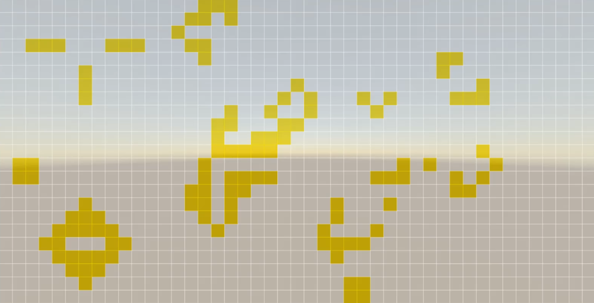
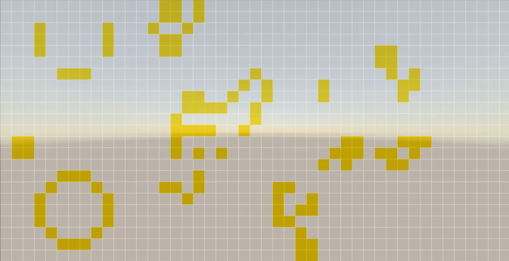

<h1>Game-of-Life</h1>
<h4>Convoy's Game of life Implemented in Unity3D</h4>
The Game of Life, also known simply as Life, is a cellular automaton devised by the British mathematician John Horton Conway in 1970.[1]

The game is a zero-player game, meaning that its evolution is determined by its initial state, requiring no further input. One interacts with the Game of Life by creating an initial configuration and observing how it evolves. It is Turing complete and can simulate a universal constructor or any other Turing machine.

<h4>Here How it will work</h4>
1. run on the unity3D  
2. press on any tile white==dead tile && yellow=alive tile 
3. press space whenever you're ready. 

<h4>Initial Frame</h4>

<h4>After first Frame</h4>

<h4>Cheers!</h4>
